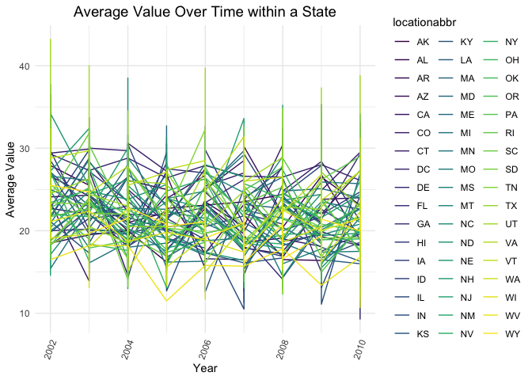
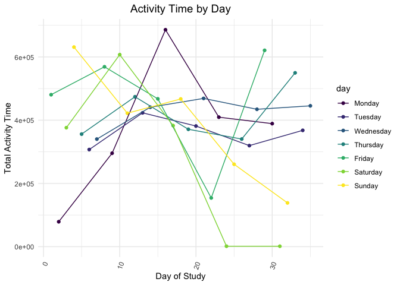

p8105\_hw3\_bg2645
================
Bing Bing Guo
10/9/2019

## Question 1

``` r
library(tidyverse)
```

    ## ── Attaching packages ─────────────────────────────────────────────────────────────────────────── tidyverse 1.2.1 ──

    ## ✔ ggplot2 3.2.1     ✔ purrr   0.3.2
    ## ✔ tibble  2.1.3     ✔ dplyr   0.8.3
    ## ✔ tidyr   1.0.0     ✔ stringr 1.4.0
    ## ✔ readr   1.3.1     ✔ forcats 0.4.0

    ## ── Conflicts ────────────────────────────────────────────────────────────────────────────── tidyverse_conflicts() ──
    ## ✖ dplyr::filter() masks stats::filter()
    ## ✖ dplyr::lag()    masks stats::lag()

``` r
library(p8105.datasets)
library(dplyr)
library(viridis)
```

    ## Loading required package: viridisLite

``` r
library(ggridges) 
```

    ## 
    ## Attaching package: 'ggridges'

    ## The following object is masked from 'package:ggplot2':
    ## 
    ##     scale_discrete_manual

``` r
library(patchwork)
data("instacart")
```

  - There were 1384617 observations and 15 variables in the `instacart`
    dataset.
  - The key variables in the `instacart` dataset were the porducts that
    were ordered, the order in which they were added into the cart, if
    this item has previously been reordered, what time and day of week
    the order was placed, and the aisle and department for each product,
    and the unique user\_id for each customer. \*Thus, based on the
    observations you can see that for example, on what day of the which
    and on which hour did they place an order for bulgarian yoghurt,
    which aisle and department this item belongs to, if they had
    previously ordered it before and how many days it had been since
    their last order, and in what order they had put this item in their
    cart.

<!-- end list -->

``` r
instacart %>%
  count(aisle_id, name = "n")%>%
arrange(desc(n))
```

    ## # A tibble: 134 x 2
    ##    aisle_id      n
    ##       <int>  <int>
    ##  1       83 150609
    ##  2       24 150473
    ##  3      123  78493
    ##  4      120  55240
    ##  5       21  41699
    ##  6      115  36617
    ##  7       84  32644
    ##  8      107  31269
    ##  9       91  26240
    ## 10      112  23635
    ## # … with 124 more rows

  - There are 134 aisles in instacart, the most ordered items are from
    aisle 83, 24, and 123 respectively - in which aisle 83 had the most
    ordered items out out of all the aisles.

**Make a plot that shows the number of items ordered in each aisle,
limiting this to aisles with more than 10000 items ordered**

``` r
instacart %>%
group_by(aisle) %>%
summarize(n_aisle = n()) %>%
filter(n_aisle> 10000) %>%
arrange((desc(n_aisle))) %>%
ggplot(aes(x = aisle , y = n_aisle,color=aisle)) + geom_point() + 
labs(
    title = "Number of Items Ordered in Each Aisle", 
    x = "Aisle",
    y = "Number of Items Ordered (n)",
    caption = "This plot shows the number of items ordered in each aisle, limited to aisles with more than 10,000 items ordered" ) + 
viridis::scale_color_viridis(discrete = TRUE) + 
  theme_minimal() + 
  theme(
    plot.title = element_text(hjust = 0.5, size = 14),   
    plot.caption = element_text(hjust = 0, face = "italic"), 
    legend.position = "none", 
    axis.text.x = element_text(angle=70, hjust=1) ) 
```

<!-- -->

**Make a table showing the three most popular items in each of the
aisles “baking ingredients”, “dog food care”, and “packaged vegetables
fruits” - include the number of times each item is ordered**

``` r
top3_data = instacart %>%
filter(aisle %in% c("baking ingredients", "dog food care","packaged vegetables fruits")) %>%
group_by(aisle, product_name) %>%
summarize(n = n()) %>%
top_n(3) %>%
arrange(desc(n)) %>%
knitr::kable()
```

    ## Selecting by n

``` r
top3_data
```

| aisle                      | product\_name                                 |    n |
| :------------------------- | :-------------------------------------------- | ---: |
| packaged vegetables fruits | Organic Baby Spinach                          | 9784 |
| packaged vegetables fruits | Organic Raspberries                           | 5546 |
| packaged vegetables fruits | Organic Blueberries                           | 4966 |
| baking ingredients         | Light Brown Sugar                             |  499 |
| baking ingredients         | Pure Baking Soda                              |  387 |
| baking ingredients         | Cane Sugar                                    |  336 |
| dog food care              | Snack Sticks Chicken & Rice Recipe Dog Treats |   30 |
| dog food care              | Organix Chicken & Brown Rice Recipe           |   28 |
| dog food care              | Small Dog Biscuits                            |   26 |

**Make a table showing the mean hour of the day at which Pink Lady
Apples and Coffee Ice Cream are ordered on each day of the week**

``` r
instacart %>%
select(product_name, order_dow, order_hour_of_day) %>%
group_by(product_name, order_dow) %>%
summarize(mean_hour = mean(order_hour_of_day)) %>%
mutate(order_dow = recode(order_dow, "0" = "Sunday", "1" = "Monday", 
                          "2" = "Tuesday", "3" = "Wednesday", "4" = "Thursday", 
                          "5" = "Friday", "6" = "Saturday"))  %>%
filter(product_name %in% c("Pink Lady Apples", "Coffee Ice Cream"))  %>%
pivot_wider(names_from = "order_dow", values_from = "mean_hour") %>%
knitr::kable(digits = 3)
```

| product\_name    | Sunday | Monday | Tuesday | Wednesday | Thursday | Friday | Saturday |
| :--------------- | -----: | -----: | ------: | --------: | -------: | -----: | -------: |
| Coffee Ice Cream | 13.774 | 14.316 |  15.381 |    15.318 |   15.217 | 12.263 |   13.833 |
| Pink Lady Apples | 13.441 | 11.360 |  11.702 |    14.250 |   11.552 | 12.784 |   11.938 |

## Question 2

``` r
data("brfss_smart2010") 
```

**Data Cleaning**

``` r
clean_brfss_data = brfss_smart2010 %>%
janitor::clean_names() %>%
separate(locationdesc, into = c("state", "county"), sep=3) %>% 
mutate(county= stringr::str_replace(county, "- ", "")) %>% 
filter(topic == "Overall Health", 
       response %in% c("Excellent", "Very good", "Good", "Fair", "Poor")) %>%
mutate(response = factor(response, levels = c("Poor","Fair","Good","Very good", "Excellent" ))) %>%
select(-state, -location_id, -data_value_footnote_symbol, -data_value_footnote)
clean_brfss_data
```

    ## # A tibble: 10,625 x 20
    ##     year locationabbr county class topic question response sample_size
    ##    <int> <chr>        <chr>  <chr> <chr> <chr>    <fct>          <int>
    ##  1  2010 AL           Jeffe… Heal… Over… How is … Excelle…          94
    ##  2  2010 AL           Jeffe… Heal… Over… How is … Very go…         148
    ##  3  2010 AL           Jeffe… Heal… Over… How is … Good             208
    ##  4  2010 AL           Jeffe… Heal… Over… How is … Fair             107
    ##  5  2010 AL           Jeffe… Heal… Over… How is … Poor              45
    ##  6  2010 AL           Mobil… Heal… Over… How is … Excelle…          91
    ##  7  2010 AL           Mobil… Heal… Over… How is … Very go…         177
    ##  8  2010 AL           Mobil… Heal… Over… How is … Good             224
    ##  9  2010 AL           Mobil… Heal… Over… How is … Fair             120
    ## 10  2010 AL           Mobil… Heal… Over… How is … Poor              66
    ## # … with 10,615 more rows, and 12 more variables: data_value <dbl>,
    ## #   confidence_limit_low <dbl>, confidence_limit_high <dbl>,
    ## #   display_order <int>, data_value_unit <chr>, data_value_type <chr>,
    ## #   data_source <chr>, class_id <chr>, topic_id <chr>, question_id <chr>,
    ## #   respid <chr>, geo_location <chr>

**States were observed at 7 or more locations in 2002**

``` r
clean_brfss_data %>% 
filter(year == 2002) %>%
group_by (locationabbr)  %>%
summarize(n_locations = n_distinct(county)) %>%
filter(n_locations >= 7) %>%
arrange(n_locations) 
```

    ## # A tibble: 6 x 2
    ##   locationabbr n_locations
    ##   <chr>              <int>
    ## 1 CT                     7
    ## 2 FL                     7
    ## 3 NC                     7
    ## 4 MA                     8
    ## 5 NJ                     8
    ## 6 PA                    10

  - Connecticut, Florida, North Carolina, Massachusettes, New Jersey,
    and Pennslyvania were all observed at 7 or more locations in 2002.
    Thus, 6 states were observed at 7 or more locations.

**States were observed at 7 or more locations in 2010**

``` r
clean_brfss_data %>% 
filter(year == 2010) %>%
group_by (locationabbr)  %>%
summarize(n_locations = n_distinct(county)) %>%
filter(n_locations >= 7) %>%
arrange(n_locations)
```

    ## # A tibble: 14 x 2
    ##    locationabbr n_locations
    ##    <chr>              <int>
    ##  1 CO                     7
    ##  2 PA                     7
    ##  3 SC                     7
    ##  4 OH                     8
    ##  5 MA                     9
    ##  6 NY                     9
    ##  7 NE                    10
    ##  8 WA                    10
    ##  9 CA                    12
    ## 10 MD                    12
    ## 11 NC                    12
    ## 12 TX                    16
    ## 13 NJ                    19
    ## 14 FL                    41

  - Colorado, Pennslyvania, South Carolina, Ohio, Massachusettes, New
    York, Nebraska, Washington, California, Maryland, North Carolina,
    Texas, New Jersey, and Florida were all observed at 7 or more
    locations in 2010. Thus 14 states were observed at 7 more more
    locations.

**Construct a dataset that is limited to `Excellent` responses, and
contains, year, state, and a variable that averages the `data_value`
across locations within a state**

``` r
excellent_data = clean_brfss_data %>%
filter(response=="Excellent")%>% 
group_by(year, locationabbr, county) %>% 
summarize(mean_value = mean(data_value)) 
excellent_data
```

    ## # A tibble: 2,125 x 4
    ## # Groups:   year, locationabbr [443]
    ##     year locationabbr county                 mean_value
    ##    <int> <chr>        <chr>                       <dbl>
    ##  1  2002 AK           Anchorage Municipality       27.9
    ##  2  2002 AL           Jefferson County             18.5
    ##  3  2002 AR           Pulaski County               24.1
    ##  4  2002 AZ           Maricopa County              21.6
    ##  5  2002 AZ           Pima County                  26.6
    ##  6  2002 CA           Los Angeles County           22.7
    ##  7  2002 CO           Adams County                 21.2
    ##  8  2002 CO           Arapahoe County              25.5
    ##  9  2002 CO           Denver County                22.2
    ## 10  2002 CO           Jefferson County             23.4
    ## # … with 2,115 more rows

**Make a “spaghetti” plot of this average value over time within a
state**

``` r
excellent_data %>%
ggplot(aes(x = year , y = mean_value, color=locationabbr)) + geom_line() + 
labs(
    title = "Average Value Over Time within a State", 
    x = "Year",
    y = "Average Value") + 
viridis::scale_color_viridis(discrete = TRUE) + 
  theme_minimal() + 
  theme(
    plot.title = element_text(hjust = 0.5, size = 14), 
    axis.text.x = element_text(angle=70, hjust=1))
```

<!-- -->

**Make a two-panel plot showing, for the years 2006, and 2010,
distribution of data\_value for responses (“Poor” to “Excellent”) among
locations in NY State**

``` r
combined_plot = 
clean_brfss_data %>%
  filter(topic == "Overall Health",  
         year == "2006" | 
         year == "2010",
         locationabbr == "NY") 
combined_plot
```

    ## # A tibble: 75 x 20
    ##     year locationabbr county class topic question response sample_size
    ##    <int> <chr>        <chr>  <chr> <chr> <chr>    <fct>          <int>
    ##  1  2010 NY           Bronx… Heal… Over… How is … Excelle…          61
    ##  2  2010 NY           Bronx… Heal… Over… How is … Very go…         105
    ##  3  2010 NY           Bronx… Heal… Over… How is … Good             151
    ##  4  2010 NY           Bronx… Heal… Over… How is … Fair              86
    ##  5  2010 NY           Bronx… Heal… Over… How is … Poor              31
    ##  6  2010 NY           Erie … Heal… Over… How is … Excelle…          69
    ##  7  2010 NY           Erie … Heal… Over… How is … Very go…         169
    ##  8  2010 NY           Erie … Heal… Over… How is … Good             154
    ##  9  2010 NY           Erie … Heal… Over… How is … Fair              69
    ## 10  2010 NY           Erie … Heal… Over… How is … Poor              16
    ## # … with 65 more rows, and 12 more variables: data_value <dbl>,
    ## #   confidence_limit_low <dbl>, confidence_limit_high <dbl>,
    ## #   display_order <int>, data_value_unit <chr>, data_value_type <chr>,
    ## #   data_source <chr>, class_id <chr>, topic_id <chr>, question_id <chr>,
    ## #   respid <chr>, geo_location <chr>

``` r
twopanel_plot = combined_plot %>% 
  ggplot(aes(x = response, y = data_value, color = response))+
  geom_boxplot()+
  facet_grid(. ~year) 
twopanel_plot
```

<!-- -->

## Question 3

**Load, tidy, and otherwise wrangle the data**

``` r
accel_data = 
  read_csv("./Data/accel_data.csv") %>% 
janitor::clean_names() %>% 
pivot_longer( 
  activity_1:activity_1440, 
  names_to = "activity_min", 
  values_to = "activity_count") %>%
mutate(activity_min = stringr::str_replace(activity_min, "activity_", ""), 
       activity_min = as.numeric(activity_min), 
       weekday = day %in% c("Monday", "Tuesday", "Wednesday", "Thursday", "Friday"), 
       weekend = day %in% c("Saturday", "Sunday"), 
       day = factor(day, levels = c("Monday", "Tuesday", "Wednesday", "Thursday", "Friday", "Saturday", "Sunday"))) 
```

    ## Parsed with column specification:
    ## cols(
    ##   .default = col_double(),
    ##   day = col_character()
    ## )

    ## See spec(...) for full column specifications.

``` r
accel_data
```

    ## # A tibble: 50,400 x 7
    ##     week day_id day    activity_min activity_count weekday weekend
    ##    <dbl>  <dbl> <fct>         <dbl>          <dbl> <lgl>   <lgl>  
    ##  1     1      1 Friday            1           88.4 TRUE    FALSE  
    ##  2     1      1 Friday            2           82.2 TRUE    FALSE  
    ##  3     1      1 Friday            3           64.4 TRUE    FALSE  
    ##  4     1      1 Friday            4           70.0 TRUE    FALSE  
    ##  5     1      1 Friday            5           75.0 TRUE    FALSE  
    ##  6     1      1 Friday            6           66.3 TRUE    FALSE  
    ##  7     1      1 Friday            7           53.8 TRUE    FALSE  
    ##  8     1      1 Friday            8           47.8 TRUE    FALSE  
    ##  9     1      1 Friday            9           55.5 TRUE    FALSE  
    ## 10     1      1 Friday           10           43.0 TRUE    FALSE  
    ## # … with 50,390 more rows

  - There were 50400 observations and 7 variables in the `accel_data`
    dataset. The mean activity count was 267.0440592. Weekday and
    Weekend are logical variables in which the values are either True or
    False, depending on if the day is a a weekday or not.
  - The key variables in the `accel_data` dataset was the week, day id,
    day, activity in minutes, activity count, and variables determining
    whether the day was a weekday or not. The day variable was a factor
    variable that was categorized into levels.

**Aggregate across minutes to create a total activity variable for each
day, and create a table showing these totals**

``` r
total_activity_data = accel_data %>%
  group_by(day) %>%
  summarize(total_activity = sum(activity_count)) %>%
  knitr::kable()
total_activity_data
```

| day       | total\_activity |
| :-------- | --------------: |
| Monday    |         1858699 |
| Tuesday   |         1799238 |
| Wednesday |         2129772 |
| Thursday  |         2091151 |
| Friday    |         2291711 |
| Saturday  |         1369237 |
| Sunday    |         1919213 |

  - no trend was observed, however Friday had the highest
    total\_activity value.

**Make a single-panel plot that shows the 24-hour activity time courses
for each day and use color to indicate day of the week**

``` r
accel_data %>%
group_by(day_id, day) %>% 
summarize(total_activity = sum(activity_count)) %>% 
ggplot(aes(x = day_id, y = total_activity, color = day)) + geom_point() + geom_line() +
labs(title = "Activity Time by Day", 
     x = "Day of Study",
     y = "Total Activity Time") + 
  viridis::scale_color_viridis(discrete = TRUE) + 
  theme_minimal() + 
  theme(
    plot.title = element_text(hjust = 0.5, size = 14), 
    axis.text.x = element_text(angle=70, hjust=1))
```

<!-- -->

  - Based on the plot above, total activity time decreases on weekends
    compared to weekdays. Activity level on weekdays seemed to be more
    constant across days. There was spike in actvity levels on Mondays
    on from ~day 9 to ~day 16 and there was also another spike in
    activity level on Fridays from day 22 to 28. You can see that on
    Saturdays starting from ~day 14 the activity level goes to zero and
    remains there.
